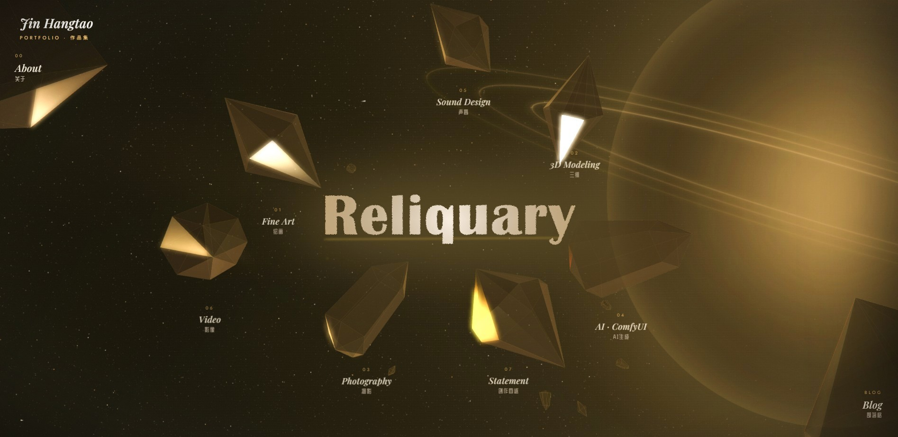
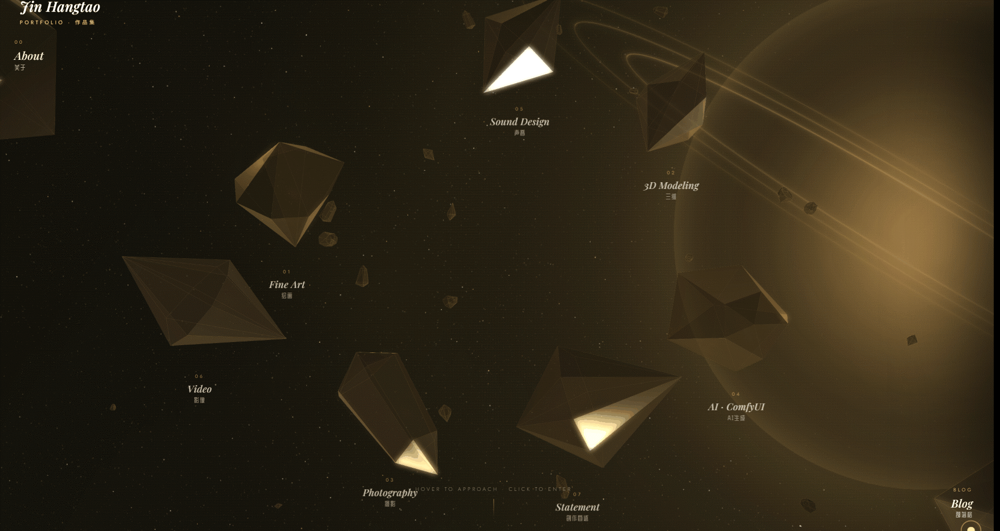

  
# Reliquary
  

Welcome to my blog and memories of me 🚀✨🪐

<a href="https://jinhangtao.github.io/blog" target="_blank">
  <button style="background-color:#1E40AF; color:white; padding:10px 20px; border-radius:5px; border:none; cursor:pointer;">
    Other Blog 🚀
  </button>
</a>

---

## What it is

A place to hold the work made between ages 13 and 18 — drawings, 3D scenes, photography — before that version of the person gets too far away.

---

## Tech

- **Three.js** — floating crystal fragments as navigation
- **Canvas 2D** — procedurally drawn planet, rings, and star field
- **Web Audio API** — fully custom audio engine: ambient tone, hover sounds, click sounds, panel/lightbox transitions, and an FM synthesis easter egg with six microtonal voices
- **CSS** — custom cursor, right-side drawer panel (desktop), bottom-sheet panel (mobile), lightbox, grain overlay
- Zero dependencies beyond Three.js. Zero frameworks.

---

This site exists because I wanted to keep something before it disappears.

An immersive digital gallery blending art and technology, featuring original works in a cosmic-themed, interactive environment.
